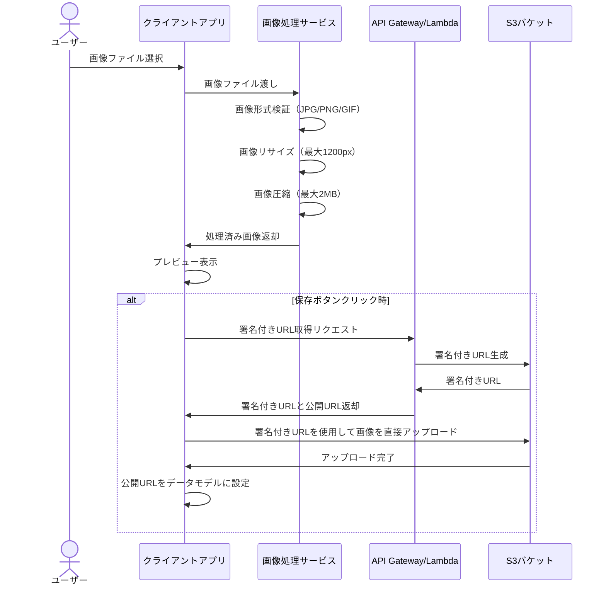

# 画像処理フロー

このドキュメントでは、Bonsai App（盆栽管理アプリ）における画像処理のフローを定義します。

## 画像アップロードフロー

## 画像処理仕様

### リサイズ仕様
- 最大幅/高さ: 1200px
- アスペクト比は維持
- 元画像が小さい場合は拡大しない

### 圧縮仕様
- 最大ファイルサイズ: 2MB
- JPEG圧縮品質: 70%（初期値）
- PNG/GIF圧縮品質: 90%（初期値）
- 2MB超の場合、段階的に圧縮品質を下げる

### サポート形式
- JPEG/JPG
- PNG
- GIF（アニメーションGIFは非推奨）

## 将来的な拡張性

現在は1枚の画像のみサポートしていますが、将来的には複数画像のアップロードをサポートする予定です。その際には以下の変更が必要になります：

1. UIの拡張（複数画像のプレビューとアップロード）
2. 画像の並べ替え機能
3. サムネイル生成機能（必要に応じて）

## エラーハンドリング

画像アップロード処理では以下のエラーケースを考慮します：

1. 非対応ファイル形式
2. サイズ超過（圧縮後も2MBを超える場合）
3. アップロード失敗（ネットワークエラーなど）
4. S3バケットへのアクセス権限エラー

各エラーケースに対して、ユーザーフレンドリーなエラーメッセージを表示します。
