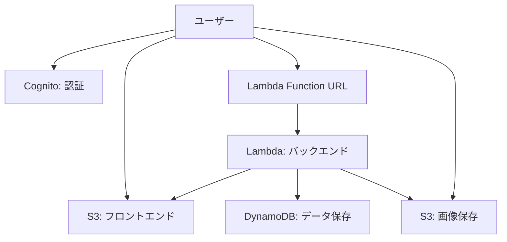
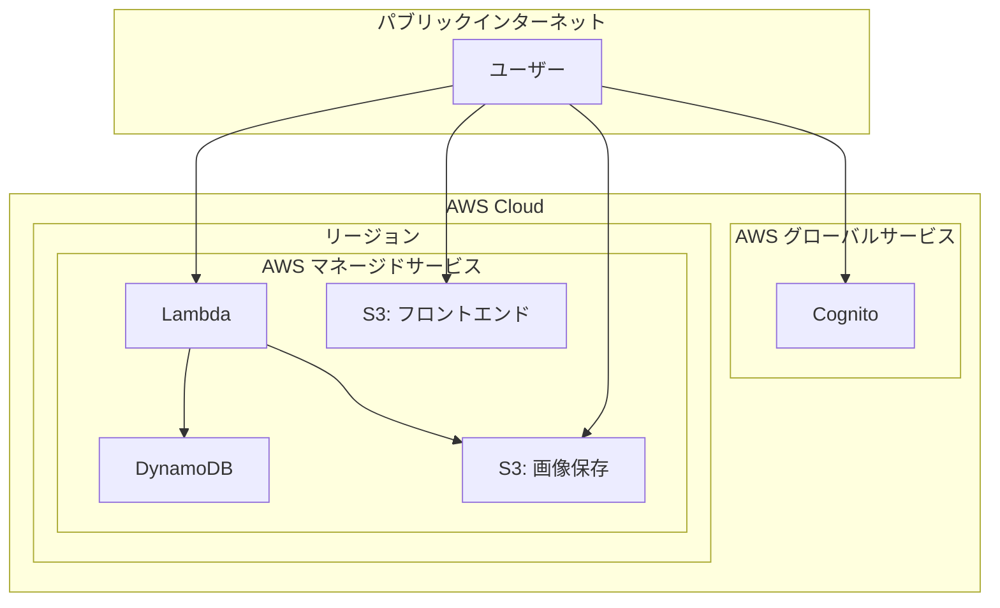

# インフラストラクチャ構成

このドキュメントでは、Bonsai App（盆栽管理アプリ）のインフラストラクチャ構成を定義します。この構成は、個人開発や少数ユーザー向けに最適化され、AWSの無料枠内での運用を目指しています。

## 目次

1. [概要](#概要)
2. [アーキテクチャ図](#アーキテクチャ図)
3. [コンポーネント詳細](#コンポーネント詳細)
4. [環境構成](#環境構成)
5. [セキュリティ](#セキュリティ)
6. [コスト最適化](#コスト最適化)
7. [監視とロギング](#監視とロギング)

## 概要

Bonsai App（盆栽管理アプリ）は、AWSの無料枠を最大限に活用するサーバーレスアーキテクチャを採用しています。フロントエンドはS3の静的ウェブサイトホスティングを使用し、バックエンドはLambda Function URLを通じて直接アクセスします。データストアにはDynamoDBを使用し、認証はAmazon Cognitoで管理します。盆栽の画像は別のS3バケットに保存します。

すべてのインフラストラクチャはCloudFormationを使用してコード化され、GitHubリポジトリで管理されています。CI/CDパイプラインはGitHub Actionsを使用して自動化されています。

## アーキテクチャ図

### 全体アーキテクチャ（簡素化版）

### ネットワーク構成（簡素化版）

## コンポーネント詳細（簡素化版）

### フロントエンド

| コンポーネント | 説明 |
|--------------|------|
| **S3 バケット（フロントエンド）** | Angularで構築されたSPAと静的コンテンツを単一のバケットでホスティングします。S3の静的ウェブサイトホスティング機能を使用します。 |
| **S3 バケット（画像保存）** | 盆栽の画像や作業記録の画像を保存するためのバケットです。画像のアップロード/ダウンロードはフロントエンドから直接行います。 |

### バックエンド

| コンポーネント | 説明 |
|--------------|------|
| **Lambda Function URL** | API Gatewayを使わず、Lambda関数に直接HTTPSエンドポイントを提供します。認証はCognitoと連携します。 |
| **Lambda** | Node.jsで実装されたサーバーレス関数。ビジネスロジックを処理し、DynamoDBとの通信を行います。 |

### データストア

| コンポーネント | 説明 |
|--------------|------|
| **DynamoDB** | NoSQLデータベースとして使用され、盆栽データ、作業記録、作業予定、ユーザーデータなどを保存します。プロビジョンドキャパシティモードで最小設定を使用します。 |

### 認証と認可

| コンポーネント | 説明 |
|--------------|------|
| **Cognito User Pool** | ユーザー認証を管理し、サインアップ、サインイン、アカウント回復などの機能を提供します。無料枠内で使用します。 |

## 環境構成（簡素化版）

Bonsai Appは以下の2つの環境で構成されています：

### 開発環境（dev）

- 開発者が新機能を開発・テストするための環境
- `develop`ブランチのコードがデプロイされる
- 本番環境と同じアーキテクチャを使用

### 本番環境（prod）

- エンドユーザーが使用する環境
- `main`ブランチのコードがデプロイされる
- 無料枠内で運用可能な最小構成

各環境は独立したCloudFormationスタックとして管理され、環境間の分離が確保されています。ステージング環境は省略し、開発環境でのテストを徹底することで代替します。

## セキュリティ（簡素化版）

### データ保護

| 対策 | 説明 |
|-----|------|
| **転送中の暗号化** | すべての通信はHTTPSで保護されています。S3静的ウェブサイトホスティングもHTTPSを使用します。 |
| **保存データの暗号化** | DynamoDBテーブルとS3バケットはサーバーサイド暗号化（SSE）を使用して保存データを暗号化します。 |
| **バックアップ** | 定期的な手動バックアップを実施します。 |

### アクセス制御

| 対策 | 説明 |
|-----|------|
| **認証** | Cognitoを使用してユーザー認証を管理します。 |
| **認可** | Lambda Function URLリクエストはCognitoのIDトークンで認証され、Lambda関数内でユーザーの権限が検証されます。 |
| **最小権限の原則** | 各IAMロールには、必要最小限の権限のみが付与されています。 |
| **画像アクセス制御** | 画像保存用S3バケットへのアクセスはCognitoで認証されたユーザーのみに制限します。 |

## コスト最適化

### AWS無料枠の活用

| サービス | 無料枠の制限 | 使用方法 |
|---------|------------|---------|
| **Lambda** | 毎月100万回の無料リクエスト、400,000 GB秒のコンピューティング時間 | 関数のメモリを最小限に設定し、実行時間を最適化 |
| **S3** | 5GBのストレージ、20,000 GET/月、2,000 PUT/月 | 静的アセットの最適化、不要なファイルの削除、画像の圧縮 |
| **DynamoDB** | 25GBのストレージ、読み込み/書き込みキャパシティユニットを最小設定 | プロビジョンドキャパシティモードで最小設定を使用 |
| **Cognito** | 50,000 MAU（月間アクティブユーザー） | 基本的な認証機能のみ使用 |

### コスト削減策

| 対策 | 説明 |
|-----|------|
| **API Gateway削除** | Lambda Function URLを直接使用することでAPI Gatewayのコストを削減 |
| **CloudFront削除** | 少数ユーザー向けにはS3静的ウェブサイトホスティングで十分 |
| **通知システム簡素化** | SNS/SES/Pinpointを使わず、アプリ内通知のみに限定 |
| **リアルタイム更新機能削除** | WebSocket APIとDynamoDB Streamsを使わず、ポーリングで対応 |
| **画像サイズ最適化** | アップロード前に画像をクライアント側で圧縮し、ストレージコストを削減 |

## 監視とロギング（簡素化版）

### ロギング

| コンポーネント | ロギング方法 |
|--------------|-------------|
| **Lambda** | CloudWatchログに関数の実行ログを記録します。 |
| **S3** | 必要に応じてバケットアクセスログを有効にします。 |

### モニタリング

| 対策 | 説明 |
|-----|------|
| **CloudWatch 基本モニタリング** | 無料の基本モニタリングを使用し、主要なメトリクスを監視します。 |
| **AWS Budgets** | 月間コストの予算アラートを設定し、無料枠を超えないようにします。 |

### 機能への影響と対策

| 影響 | 対策 |
|-----|------|
| **グローバル配信の速度低下** | 少数ユーザーであれば許容範囲。必要に応じてCloudFrontを追加可能。 |
| **リアルタイム更新の制限** | ポーリングベースの更新で対応。更新頻度を調整して最適化。 |
| **プッシュ通知の制限** | アプリ内通知のみとし、重要な通知はメールで補完。 |
| **画像読み込み速度** | 画像のサムネイル生成と適切なサイズでの提供により、読み込み速度を最適化。 |
