# 処理フロー

このドキュメントでは、Bonsai App（盆栽管理アプリ）の主要な処理フローを定義します。

## 目次

1. [認証フロー](#認証フロー)
2. [盆栽管理フロー](#盆栽管理フロー)
3. [作業記録管理フロー](#作業記録管理フロー)
4. [作業予定管理フロー](#作業予定管理フロー)
5. [ダッシュボードカレンダーフロー](#ダッシュボードカレンダーフロー)
6. [月次レポートフロー](#月次レポートフロー)

## 認証フロー

### サインアップフロー

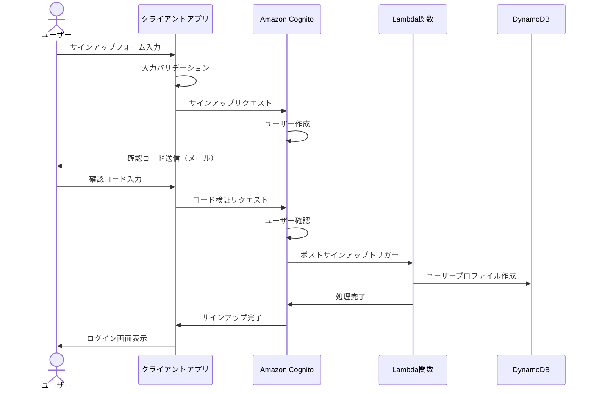
```mermaid
sequenceDiagram
    actor User as ユーザー
    participant Client as クライアントアプリ
    participant Cognito as Amazon Cognito
    participant Lambda as Lambda関数
    participant DynamoDB as DynamoDB

    User->>Client: サインアップフォーム入力
    Client->>Client: 入力バリデーション
    Client->>Cognito: サインアップリクエスト
    Cognito->>Cognito: ユーザー作成
    Cognito->>User: 確認コード送信（メール）
    User->>Client: 確認コード入力
    Client->>Cognito: コード検証リクエスト
    Cognito->>Cognito: ユーザー確認
    Cognito->>Lambda: ポストサインアップトリガー
    Lambda->>DynamoDB: ユーザープロファイル作成
    Lambda->>Cognito: 処理完了
    Cognito->>Client: サインアップ完了
    Client->>User: ログイン画面表示
```

### サインインフロー

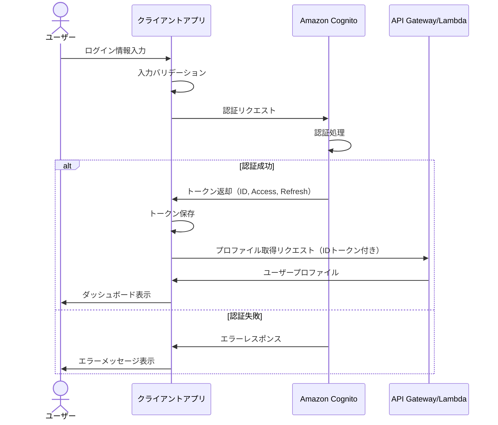
```mermaid
sequenceDiagram
    actor User as ユーザー
    participant Client as クライアントアプリ
    participant Cognito as Amazon Cognito
    participant API as API Gateway/Lambda

    User->>Client: ログイン情報入力
    Client->>Client: 入力バリデーション
    Client->>Cognito: 認証リクエスト
    Cognito->>Cognito: 認証処理
    alt 認証成功
        Cognito->>Client: トークン返却（ID, Access, Refresh）
        Client->>Client: トークン保存
        Client->>API: プロファイル取得リクエスト（IDトークン付き）
        API->>Client: ユーザープロファイル
        Client->>User: ダッシュボード表示
    else 認証失敗
        Cognito->>Client: エラーレスポンス
        Client->>User: エラーメッセージ表示
    end
```

### トークンリフレッシュフロー

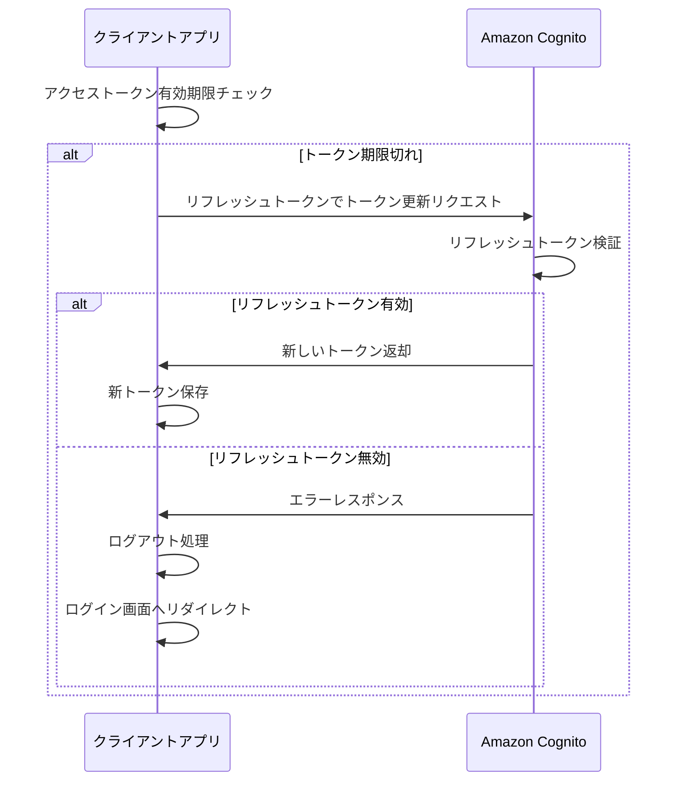
```mermaid
sequenceDiagram
    participant Client as クライアントアプリ
    participant Cognito as Amazon Cognito
    
    Client->>Client: アクセストークン有効期限チェック
    alt トークン期限切れ
        Client->>Cognito: リフレッシュトークンでトークン更新リクエスト
        Cognito->>Cognito: リフレッシュトークン検証
        alt リフレッシュトークン有効
            Cognito->>Client: 新しいトークン返却
            Client->>Client: 新トークン保存
        else リフレッシュトークン無効
            Cognito->>Client: エラーレスポンス
            Client->>Client: ログアウト処理
            Client->>Client: ログイン画面へリダイレクト
        end
    end
```

## 盆栽管理フロー

### 盆栽登録フロー

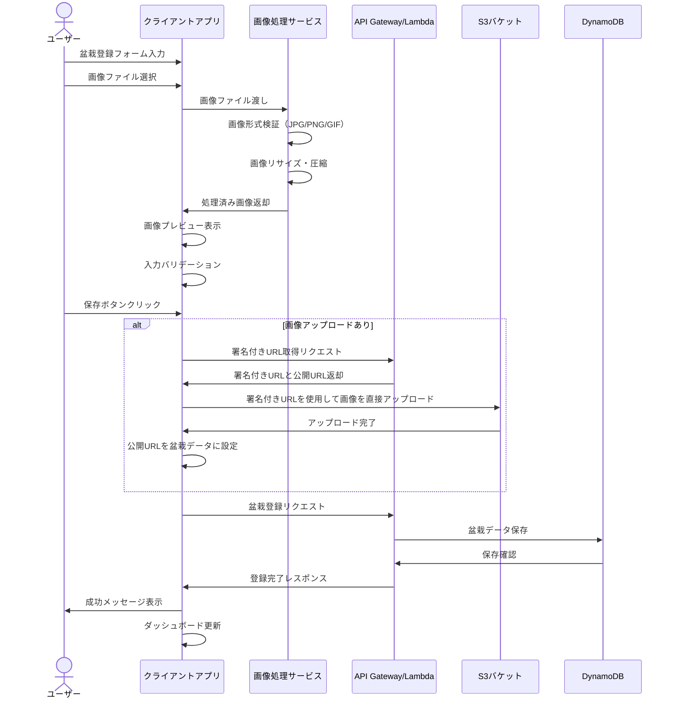
```mermaid
sequenceDiagram
    actor User as ユーザー
    participant Client as クライアントアプリ
    participant ImageService as 画像処理サービス
    participant API as API Gateway/Lambda
    participant S3 as S3バケット
    participant DynamoDB as DynamoDB

    User->>Client: 盆栽登録フォーム入力
    User->>Client: 画像ファイル選択
    Client->>ImageService: 画像ファイル渡し
    ImageService->>ImageService: 画像形式検証（JPG/PNG/GIF）
    ImageService->>ImageService: 画像リサイズ・圧縮
    ImageService->>Client: 処理済み画像返却
    Client->>Client: 画像プレビュー表示
    Client->>Client: 入力バリデーション
    User->>Client: 保存ボタンクリック
    
    alt 画像アップロードあり
        Client->>API: 署名付きURL取得リクエスト
        API->>Client: 署名付きURLと公開URL返却
        Client->>S3: 署名付きURLを使用して画像を直接アップロード
        S3->>Client: アップロード完了
        Client->>Client: 公開URLを盆栽データに設定
    end
    
    Client->>API: 盆栽登録リクエスト
    API->>DynamoDB: 盆栽データ保存
    DynamoDB->>API: 保存確認
    API->>Client: 登録完了レスポンス
    Client->>User: 成功メッセージ表示
    Client->>Client: ダッシュボード更新
```

### 盆栽編集モード遷移フロー

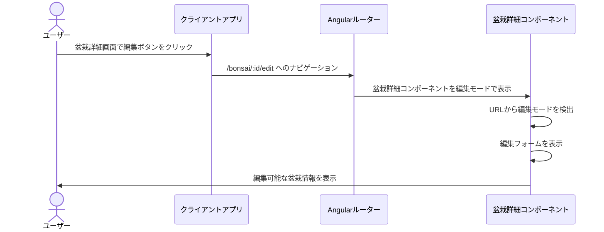
```mermaid
sequenceDiagram
    actor User as ユーザー
    participant Client as クライアントアプリ
    participant Router as Angularルーター
    participant Component as 盆栽詳細コンポーネント

    User->>Client: 盆栽詳細画面で編集ボタンをクリック
    Client->>Router: /bonsai/:id/edit へのナビゲーション
    Router->>Component: 盆栽詳細コンポーネントを編集モードで表示
    Component->>Component: URLから編集モードを検出
    Component->>Component: 編集フォームを表示
    Component->>User: 編集可能な盆栽情報を表示
```

### 盆栽詳細画面での最新作業記録表示フロー

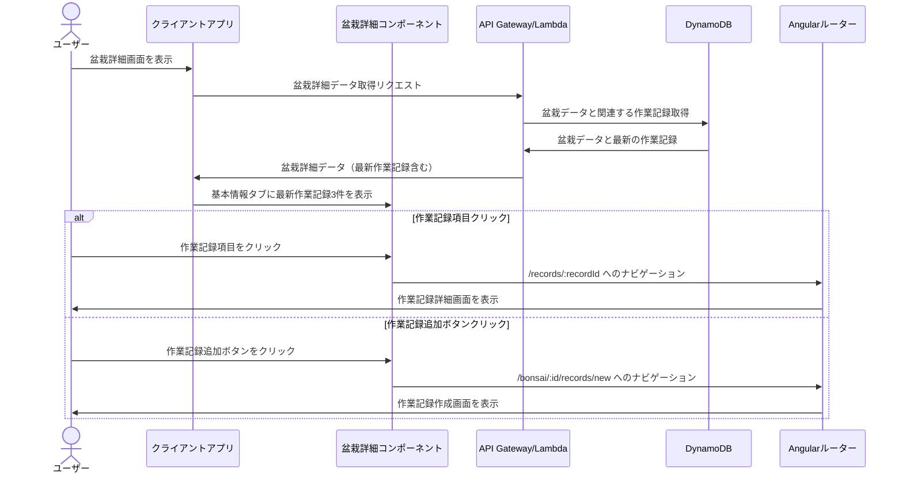
```mermaid
sequenceDiagram
    actor User as ユーザー
    participant Client as クライアントアプリ
    participant Component as 盆栽詳細コンポーネント
    participant API as API Gateway/Lambda
    participant DynamoDB as DynamoDB
    participant Router as Angularルーター

    User->>Client: 盆栽詳細画面を表示
    Client->>API: 盆栽詳細データ取得リクエスト
    API->>DynamoDB: 盆栽データと関連する作業記録取得
    DynamoDB->>API: 盆栽データと最新の作業記録
    API->>Client: 盆栽詳細データ（最新作業記録含む）
    Client->>Component: 基本情報タブに最新作業記録3件を表示
    
    alt 作業記録項目クリック
        User->>Component: 作業記録項目をクリック
        Component->>Router: /records/:recordId へのナビゲーション
        Router->>User: 作業記録詳細画面を表示
    else 作業記録追加ボタンクリック
        User->>Component: 作業記録追加ボタンをクリック
        Component->>Router: /bonsai/:id/records/new へのナビゲーション
        Router->>User: 作業記録作成画面を表示
    end
```

### 盆栽詳細画面での作業記録タブ表示フロー

```mermaid
sequenceDiagram
    actor User as ユーザー
    participant Client as クライアントアプリ
    participant Component as 盆栽詳細コンポーネント
    participant WorkRecordService as 作業記録サービス
    participant API as API Gateway/Lambda
    participant DynamoDB as DynamoDB
    participant Router as Angularルーター

    User->>Component: 作業記録タブをクリック
    Component->>Component: activeTab = 'records' に設定
    Component->>WorkRecordService: 作業記録一覧取得リクエスト
    WorkRecordService->>API: 作業記録一覧取得API呼び出し
    API->>DynamoDB: 盆栽IDに紐づく作業記録取得
    DynamoDB->>API: 作業記録一覧
    API->>WorkRecordService: 作業記録一覧レスポンス
    WorkRecordService->>Component: 作業記録一覧
    Component->>Component: 作業記録を日付の降順でソート
    Component->>User: 作業記録一覧を表示
    
    alt 作業記録項目クリック
        User->>Component: 作業記録項目をクリック
        Component->>Router: /records/:recordId へのナビゲーション
        Router->>User: 作業記録詳細画面を表示
    else 作業記録追加ボタンクリック
        User->>Component: 作業記録追加ボタンをクリック
        Component->>Router: /bonsai/:id/records/new へのナビゲーション
        Router->>User: 作業記録作成画面を表示
    end
```

### 盆栽詳細画面での作業予定タブ表示フロー

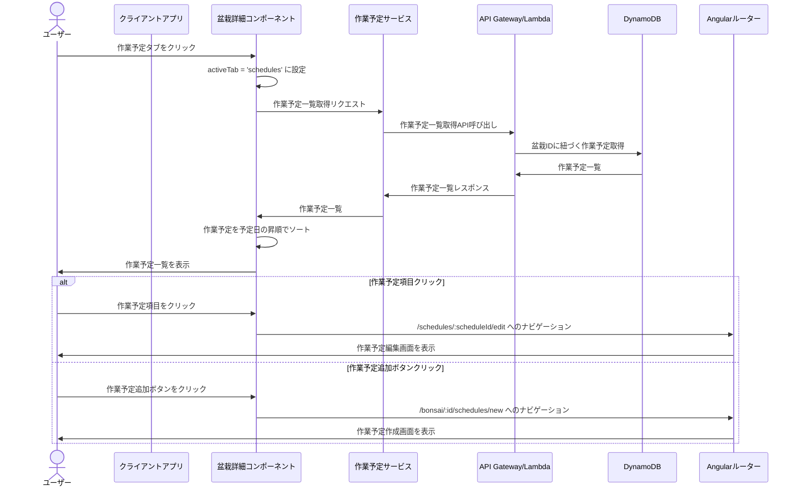
```mermaid
sequenceDiagram
    actor User as ユーザー
    participant Client as クライアントアプリ
    participant Component as 盆栽詳細コンポーネント
    participant WorkScheduleService as 作業予定サービス
    participant API as API Gateway/Lambda
    participant DynamoDB as DynamoDB
    participant Router as Angularルーター

    User->>Component: 作業予定タブをクリック
    Component->>Component: activeTab = 'schedules' に設定
    Component->>WorkScheduleService: 作業予定一覧取得リクエスト
    WorkScheduleService->>API: 作業予定一覧取得API呼び出し
    API->>DynamoDB: 盆栽IDに紐づく作業予定取得
    DynamoDB->>API: 作業予定一覧
    API->>WorkScheduleService: 作業予定一覧レスポンス
    WorkScheduleService->>Component: 作業予定一覧
    Component->>Component: 作業予定を予定日の昇順でソート
    Component->>User: 作業予定一覧を表示
    
    alt 作業予定項目クリック
        User->>Component: 作業予定項目をクリック
        Component->>Router: /schedules/:scheduleId/edit へのナビゲーション
        Router->>User: 作業予定編集画面を表示
    else 作業予定追加ボタンクリック
        User->>Component: 作業予定追加ボタンをクリック
        Component->>Router: /bonsai/:id/schedules/new へのナビゲーション
        Router->>User: 作業予定作成画面を表示
    end
```

### 盆栽情報更新フロー

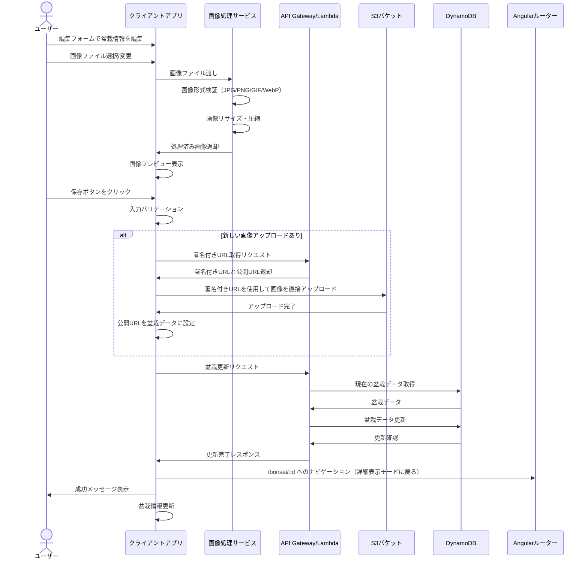
```mermaid
sequenceDiagram
    actor User as ユーザー
    participant Client as クライアントアプリ
    participant ImageService as 画像処理サービス
    participant API as API Gateway/Lambda
    participant S3 as S3バケット
    participant DynamoDB as DynamoDB
    participant Router as Angularルーター

    User->>Client: 編集フォームで盆栽情報を編集
    User->>Client: 画像ファイル選択/変更
    Client->>ImageService: 画像ファイル渡し
    ImageService->>ImageService: 画像形式検証（JPG/PNG/GIF/WebP）
    ImageService->>ImageService: 画像リサイズ・圧縮
    ImageService->>Client: 処理済み画像返却
    Client->>Client: 画像プレビュー表示
    User->>Client: 保存ボタンをクリック
    Client->>Client: 入力バリデーション
    
    alt 新しい画像アップロードあり
        Client->>API: 署名付きURL取得リクエスト
        API->>Client: 署名付きURLと公開URL返却
        Client->>S3: 署名付きURLを使用して画像を直接アップロード
        S3->>Client: アップロード完了
        Client->>Client: 公開URLを盆栽データに設定
    end
    
    Client->>API: 盆栽更新リクエスト
    API->>DynamoDB: 現在の盆栽データ取得
    DynamoDB->>API: 盆栽データ
    API->>DynamoDB: 盆栽データ更新
    DynamoDB->>API: 更新確認
    API->>Client: 更新完了レスポンス
    Client->>Router: /bonsai/:id へのナビゲーション（詳細表示モードに戻る）
    Client->>User: 成功メッセージ表示
    Client->>Client: 盆栽情報更新
```

## 作業記録管理フロー

### 作業記録登録フロー

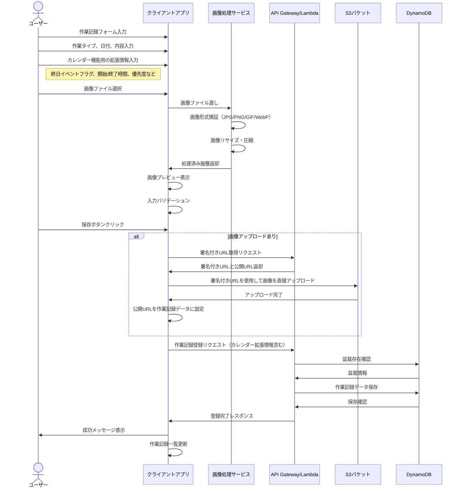
```mermaid
sequenceDiagram
    actor User as ユーザー
    participant Client as クライアントアプリ
    participant ImageService as 画像処理サービス
    participant API as API Gateway/Lambda
    participant S3 as S3バケット
    participant DynamoDB as DynamoDB

    User->>Client: 作業記録フォーム入力
    User->>Client: 作業タイプ、日付、内容入力
    User->>Client: カレンダー機能用の拡張情報入力
    note right of User: 終日イベントフラグ、開始/終了時間、優先度など
    User->>Client: 画像ファイル選択
    Client->>ImageService: 画像ファイル渡し
    ImageService->>ImageService: 画像形式検証（JPG/PNG/GIF/WebP）
    ImageService->>ImageService: 画像リサイズ・圧縮
    ImageService->>Client: 処理済み画像返却
    Client->>Client: 画像プレビュー表示
    Client->>Client: 入力バリデーション
    User->>Client: 保存ボタンクリック
    
    alt 画像アップロードあり
        Client->>API: 署名付きURL取得リクエスト
        API->>Client: 署名付きURLと公開URL返却
        Client->>S3: 署名付きURLを使用して画像を直接アップロード
        S3->>Client: アップロード完了
        Client->>Client: 公開URLを作業記録データに設定
    end
    
    Client->>API: 作業記録登録リクエスト（カレンダー拡張情報含む）
    API->>DynamoDB: 盆栽存在確認
    DynamoDB->>API: 盆栽情報
    API->>DynamoDB: 作業記録データ保存
    DynamoDB->>API: 保存確認
    API->>Client: 登録完了レスポンス
    Client->>User: 成功メッセージ表示
    Client->>Client: 作業記録一覧更新
```

### 作業記録更新フロー

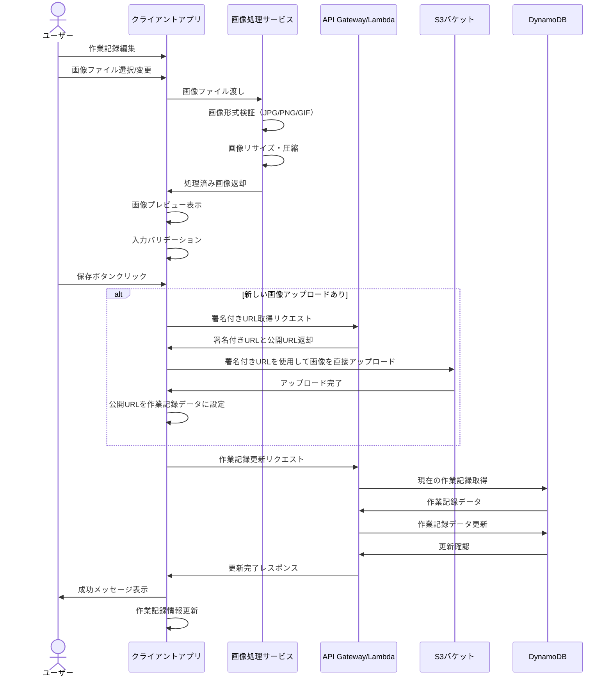
```mermaid
sequenceDiagram
    actor User as ユーザー
    participant Client as クライアントアプリ
    participant ImageService as 画像処理サービス
    participant API as API Gateway/Lambda
    participant S3 as S3バケット
    participant DynamoDB as DynamoDB

    User->>Client: 作業記録編集
    User->>Client: 画像ファイル選択/変更
    Client->>ImageService: 画像ファイル渡し
    ImageService->>ImageService: 画像形式検証（JPG/PNG/GIF）
    ImageService->>ImageService: 画像リサイズ・圧縮
    ImageService->>Client: 処理済み画像返却
    Client->>Client: 画像プレビュー表示
    Client->>Client: 入力バリデーション
    User->>Client: 保存ボタンクリック
    
    alt 新しい画像アップロードあり
        Client->>API: 署名付きURL取得リクエスト
        API->>Client: 署名付きURLと公開URL返却
        Client->>S3: 署名付きURLを使用して画像を直接アップロード
        S3->>Client: アップロード完了
        Client->>Client: 公開URLを作業記録データに設定
    end
    
    Client->>API: 作業記録更新リクエスト
    API->>DynamoDB: 現在の作業記録取得
    DynamoDB->>API: 作業記録データ
    API->>DynamoDB: 作業記録データ更新
    DynamoDB->>API: 更新確認
    API->>Client: 更新完了レスポンス
    Client->>User: 成功メッセージ表示
    Client->>Client: 作業記録情報更新
```

### 一括水やり記録作成フロー

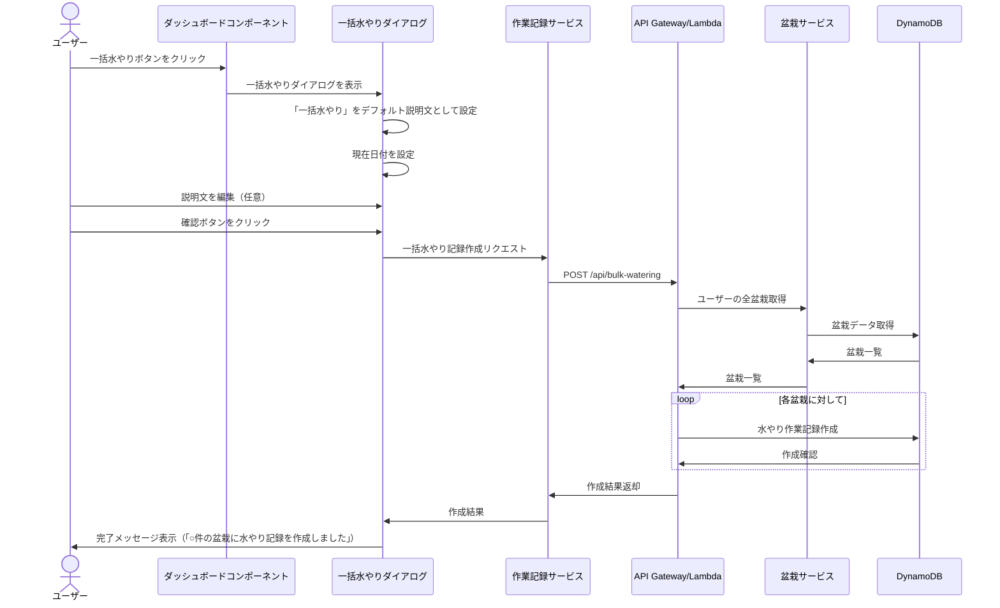
```mermaid
sequenceDiagram
    actor User as ユーザー
    participant Dashboard as ダッシュボードコンポーネント
    participant Dialog as 一括水やりダイアログ
    participant WorkRecordService as 作業記録サービス
    participant API as API Gateway/Lambda
    participant BonsaiService as 盆栽サービス
    participant DynamoDB as DynamoDB

    User->>Dashboard: 一括水やりボタンをクリック
    Dashboard->>Dialog: 一括水やりダイアログを表示
    Dialog->>Dialog: 「一括水やり」をデフォルト説明文として設定
    Dialog->>Dialog: 現在日付を設定
    User->>Dialog: 説明文を編集（任意）
    User->>Dialog: 確認ボタンをクリック
    Dialog->>WorkRecordService: 一括水やり記録作成リクエスト
    WorkRecordService->>API: POST /api/bulk-watering
    API->>BonsaiService: ユーザーの全盆栽取得
    BonsaiService->>DynamoDB: 盆栽データ取得
    DynamoDB->>BonsaiService: 盆栽一覧
    BonsaiService->>API: 盆栽一覧
    
    loop 各盆栽に対して
        API->>DynamoDB: 水やり作業記録作成
        DynamoDB->>API: 作成確認
    end
    
    API->>WorkRecordService: 作成結果返却
    WorkRecordService->>Dialog: 作成結果
    Dialog->>User: 完了メッセージ表示（「○件の盆栽に水やり記録を作成しました」）
```

## 作業予定管理フロー

### 作業予定登録フロー

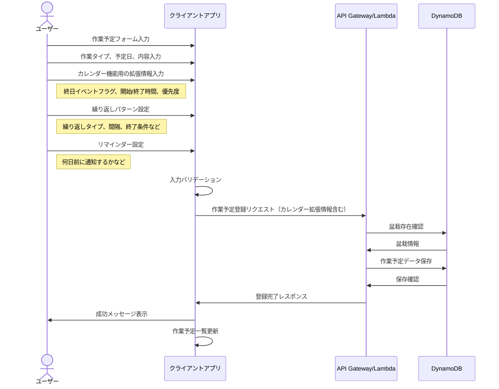
```mermaid
sequenceDiagram
    actor User as ユーザー
    participant Client as クライアントアプリ
    participant API as API Gateway/Lambda
    participant DynamoDB as DynamoDB

    User->>Client: 作業予定フォーム入力
    User->>Client: 作業タイプ、予定日、内容入力
    User->>Client: カレンダー機能用の拡張情報入力
    note right of User: 終日イベントフラグ、開始/終了時間、優先度
    User->>Client: 繰り返しパターン設定
    note right of User: 繰り返しタイプ、間隔、終了条件など
    User->>Client: リマインダー設定
    note right of User: 何日前に通知するかなど
    Client->>Client: 入力バリデーション
    Client->>API: 作業予定登録リクエスト（カレンダー拡張情報含む）
    API->>DynamoDB: 盆栽存在確認
    DynamoDB->>API: 盆栽情報
    API->>DynamoDB: 作業予定データ保存
    DynamoDB->>API: 保存確認
    API->>Client: 登録完了レスポンス
    Client->>User: 成功メッセージ表示
    Client->>Client: 作業予定一覧更新
```

### 作業予定更新フロー

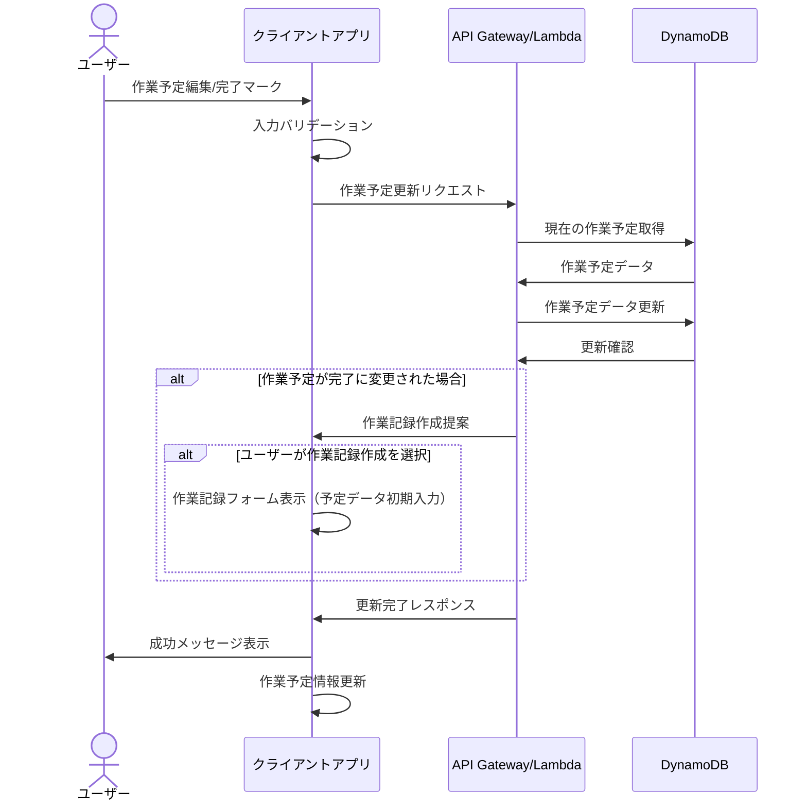
```mermaid
sequenceDiagram
    actor User as ユーザー
    participant Client as クライアントアプリ
    participant API as API Gateway/Lambda
    participant DynamoDB as DynamoDB

    User->>Client: 作業予定編集/完了マーク
    Client->>Client: 入力バリデーション
    Client->>API: 作業予定更新リクエスト
    API->>DynamoDB: 現在の作業予定取得
    DynamoDB->>API: 作業予定データ
    API->>DynamoDB: 作業予定データ更新
    DynamoDB->>API: 更新確認
    
    alt 作業予定が完了に変更された場合
        API->>Client: 作業記録作成提案
        alt ユーザーが作業記録作成を選択
            Client->>Client: 作業記録フォーム表示（予定データ初期入力）
        end
    end
    
    API->>Client: 更新完了レスポンス
    Client->>User: 成功メッセージ表示
    Client->>Client: 作業予定情報更新
```

## ダッシュボードカレンダーフロー

### カレンダーデータ読み込みフロー

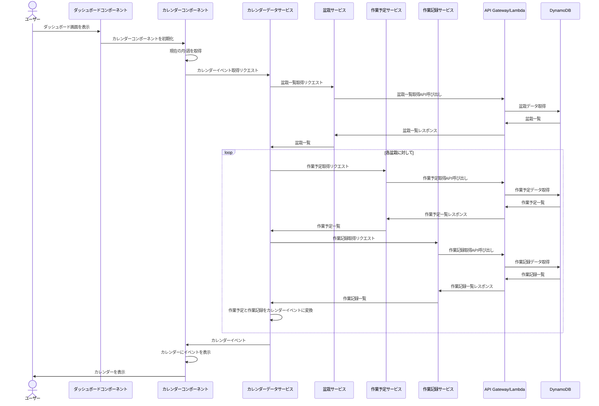
```mermaid
sequenceDiagram
    actor User as ユーザー
    participant Dashboard as ダッシュボードコンポーネント
    participant Calendar as カレンダーコンポーネント
    participant CalendarData as カレンダーデータサービス
    participant BonsaiService as 盆栽サービス
    participant ScheduleService as 作業予定サービス
    participant RecordService as 作業記録サービス
    participant API as API Gateway/Lambda
    participant DynamoDB as DynamoDB

    User->>Dashboard: ダッシュボード画面を表示
    Dashboard->>Calendar: カレンダーコンポーネントを初期化
    Calendar->>Calendar: 現在の月/週を取得
    Calendar->>CalendarData: カレンダーイベント取得リクエスト
    CalendarData->>BonsaiService: 盆栽一覧取得リクエスト
    BonsaiService->>API: 盆栽一覧取得API呼び出し
    API->>DynamoDB: 盆栽データ取得
    DynamoDB->>API: 盆栽一覧
    API->>BonsaiService: 盆栽一覧レスポンス
    BonsaiService->>CalendarData: 盆栽一覧
    
    loop 各盆栽に対して
        CalendarData->>ScheduleService: 作業予定取得リクエスト
        ScheduleService->>API: 作業予定取得API呼び出し
        API->>DynamoDB: 作業予定データ取得
        DynamoDB->>API: 作業予定一覧
        API->>ScheduleService: 作業予定一覧レスポンス
        ScheduleService->>CalendarData: 作業予定一覧
        
        CalendarData->>RecordService: 作業記録取得リクエスト
        RecordService->>API: 作業記録取得API呼び出し
        API->>DynamoDB: 作業記録データ取得
        DynamoDB->>API: 作業記録一覧
        API->>RecordService: 作業記録一覧レスポンス
        RecordService->>CalendarData: 作業記録一覧
        
        CalendarData->>CalendarData: 作業予定と作業記録をカレンダーイベントに変換
    end
    
    CalendarData->>Calendar: カレンダーイベント
    Calendar->>Calendar: カレンダーにイベントを表示
    Calendar->>User: カレンダーを表示
```

### カレンダー表示切り替えフロー

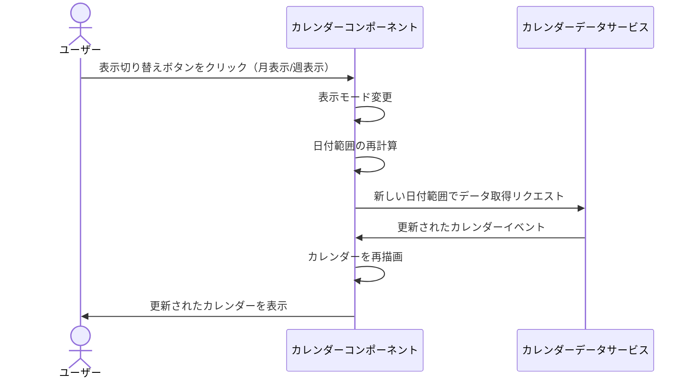
```mermaid
sequenceDiagram
    actor User as ユーザー
    participant Calendar as カレンダーコンポーネント
    participant CalendarData as カレンダーデータサービス

    User->>Calendar: 表示切り替えボタンをクリック（月表示/週表示）
    Calendar->>Calendar: 表示モード変更
    Calendar->>Calendar: 日付範囲の再計算
    Calendar->>CalendarData: 新しい日付範囲でデータ取得リクエスト
    CalendarData->>Calendar: 更新されたカレンダーイベント
    Calendar->>Calendar: カレンダーを再描画
    Calendar->>User: 更新されたカレンダーを表示
```

### カレンダーイベントクリックフロー

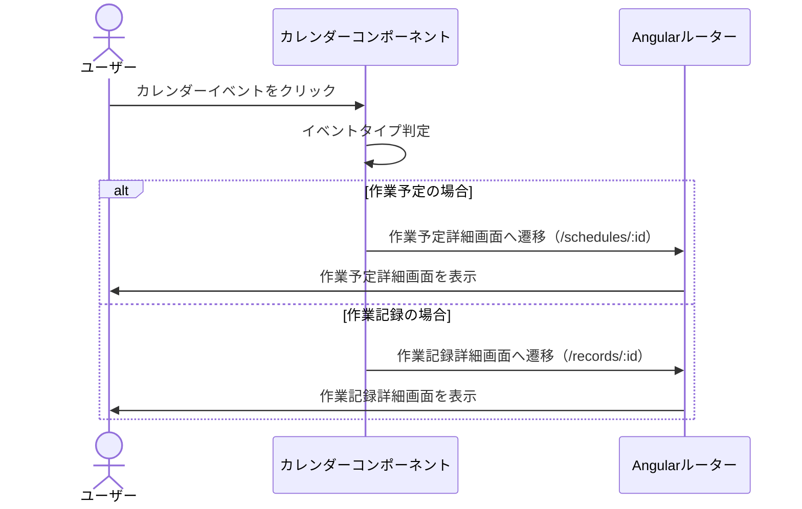
```mermaid
sequenceDiagram
    actor User as ユーザー
    participant Calendar as カレンダーコンポーネント
    participant Router as Angularルーター

    User->>Calendar: カレンダーイベントをクリック
    Calendar->>Calendar: イベントタイプ判定
    
    alt 作業予定の場合
        Calendar->>Router: 作業予定詳細画面へ遷移（/schedules/:id）
        Router->>User: 作業予定詳細画面を表示
    else 作業記録の場合
        Calendar->>Router: 作業記録詳細画面へ遷移（/records/:id）
        Router->>User: 作業記録詳細画面を表示
    end
```

## 月次レポートフロー

### 月次レポート生成フロー

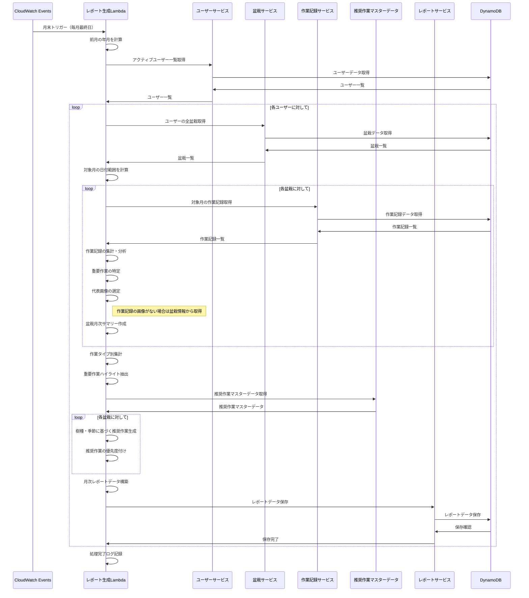
```mermaid
sequenceDiagram
    participant Scheduler as CloudWatch Events
    participant Lambda as レポート生成Lambda
    participant UserService as ユーザーサービス
    participant BonsaiService as 盆栽サービス
    participant RecordService as 作業記録サービス
    participant MasterData as 推奨作業マスターデータ
    participant ReportService as レポートサービス
    participant DB as DynamoDB

    Scheduler->>Lambda: 月末トリガー（毎月最終日）
    Lambda->>Lambda: 前月の年月を計算
    Lambda->>UserService: アクティブユーザー一覧取得
    UserService->>DB: ユーザーデータ取得
    DB->>UserService: ユーザー一覧
    UserService->>Lambda: ユーザー一覧
    
    loop 各ユーザーに対して
        Lambda->>BonsaiService: ユーザーの全盆栽取得
        BonsaiService->>DB: 盆栽データ取得
        DB->>BonsaiService: 盆栽一覧
        BonsaiService->>Lambda: 盆栽一覧
        
        Lambda->>Lambda: 対象月の日付範囲を計算
        
        loop 各盆栽に対して
            Lambda->>RecordService: 対象月の作業記録取得
            RecordService->>DB: 作業記録データ取得
            DB->>RecordService: 作業記録一覧
            RecordService->>Lambda: 作業記録一覧
            
            Lambda->>Lambda: 作業記録の集計・分析
            Lambda->>Lambda: 重要作業の特定
            Lambda->>Lambda: 代表画像の選定
                note right of Lambda: 作業記録の画像がない場合は盆栽情報から取得
            
            Lambda->>Lambda: 盆栽月次サマリー作成
        end
        
        Lambda->>Lambda: 作業タイプ別集計
        Lambda->>Lambda: 重要作業ハイライト抽出
        
        Lambda->>MasterData: 推奨作業マスターデータ取得
        MasterData->>Lambda: 推奨作業マスターデータ
        
        loop 各盆栽に対して
            Lambda->>Lambda: 樹種・季節に基づく推奨作業生成
            Lambda->>Lambda: 推奨作業の優先度付け
        end
        
        Lambda->>Lambda: 月次レポートデータ構築
        Lambda->>ReportService: レポートデータ保存
        ReportService->>DB: レポートデータ保存
        DB->>ReportService: 保存確認
        ReportService->>Lambda: 保存完了
    end
    
    Lambda->>Lambda: 処理完了ログ記録
```

### 月次レポート一覧表示フロー

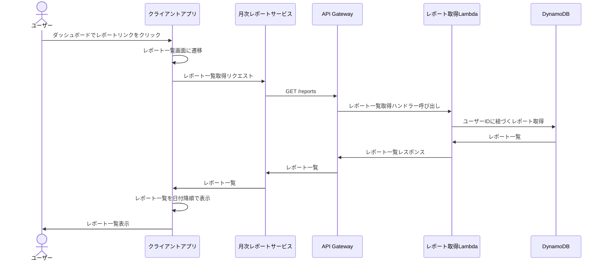
```mermaid
sequenceDiagram
    actor User as ユーザー
    participant Client as クライアントアプリ
    participant ReportService as 月次レポートサービス
    participant API as API Gateway
    participant Lambda as レポート取得Lambda
    participant DB as DynamoDB

    User->>Client: ダッシュボードでレポートリンクをクリック
    Client->>Client: レポート一覧画面に遷移
    Client->>ReportService: レポート一覧取得リクエスト
    ReportService->>API: GET /reports
    API->>Lambda: レポート一覧取得ハンドラー呼び出し
    Lambda->>DB: ユーザーIDに紐づくレポート取得
    DB->>Lambda: レポート一覧
    Lambda->>API: レポート一覧レスポンス
    API->>ReportService: レポート一覧
    ReportService->>Client: レポート一覧
    Client->>Client: レポート一覧を日付降順で表示
    Client->>User: レポート一覧表示
```

### 月次レポート詳細表示フロー

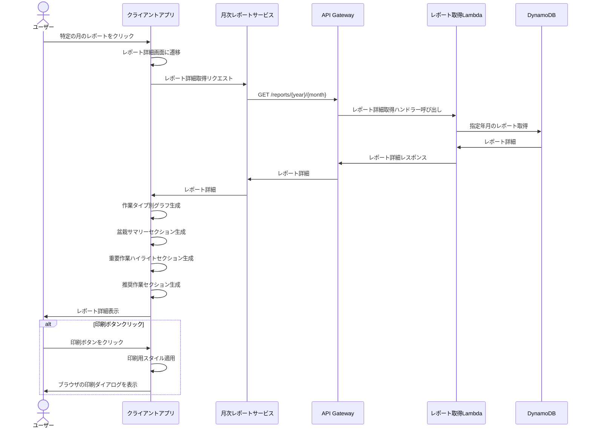
```mermaid
sequenceDiagram
    actor User as ユーザー
    participant Client as クライアントアプリ
    participant ReportService as 月次レポートサービス
    participant API as API Gateway
    participant Lambda as レポート取得Lambda
    participant DB as DynamoDB

    User->>Client: 特定の月のレポートをクリック
    Client->>Client: レポート詳細画面に遷移
    Client->>ReportService: レポート詳細取得リクエスト
    ReportService->>API: GET /reports/{year}/{month}
    API->>Lambda: レポート詳細取得ハンドラー呼び出し
    Lambda->>DB: 指定年月のレポート取得
    DB->>Lambda: レポート詳細
    Lambda->>API: レポート詳細レスポンス
    API->>ReportService: レポート詳細
    ReportService->>Client: レポート詳細
    
    Client->>Client: 作業タイプ別グラフ生成
    Client->>Client: 盆栽サマリーセクション生成
    Client->>Client: 重要作業ハイライトセクション生成
    Client->>Client: 推奨作業セクション生成
    Client->>User: レポート詳細表示
    
    alt 印刷ボタンクリック
        User->>Client: 印刷ボタンをクリック
        Client->>Client: 印刷用スタイル適用
        Client->>User: ブラウザの印刷ダイアログを表示
    end
```
