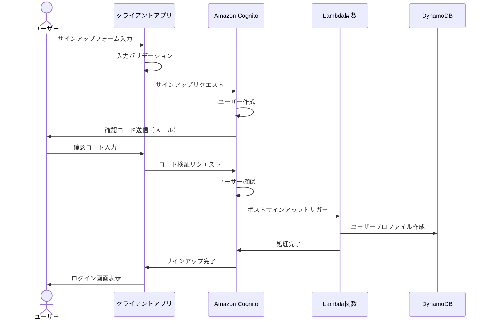
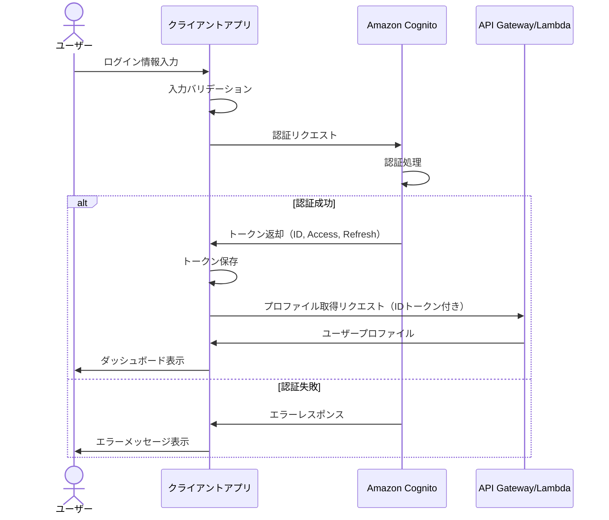
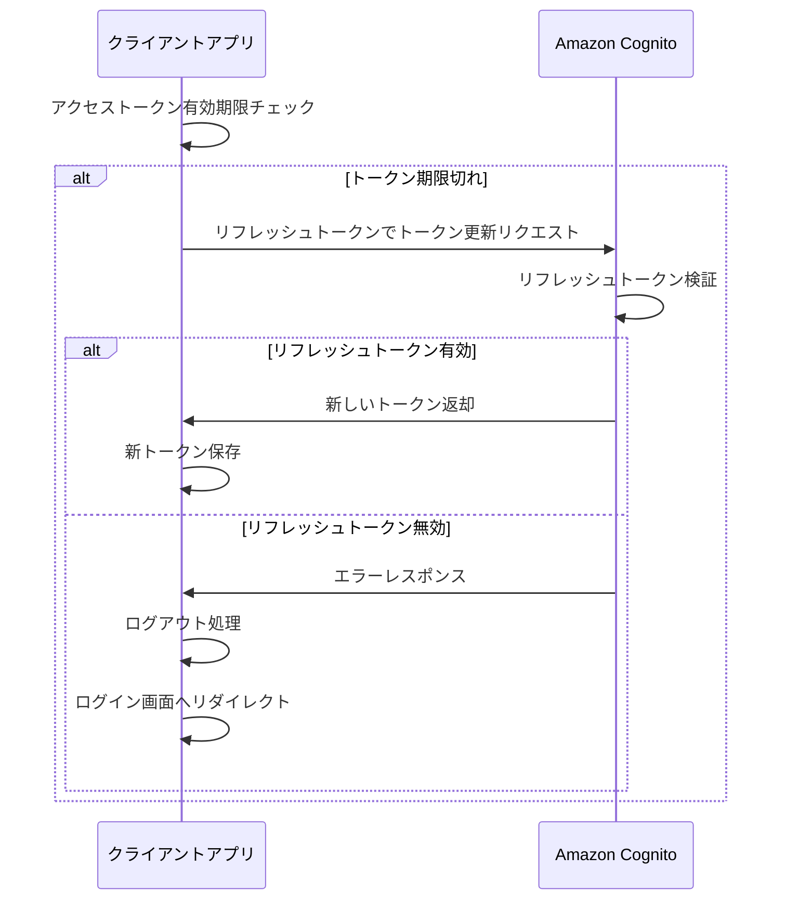
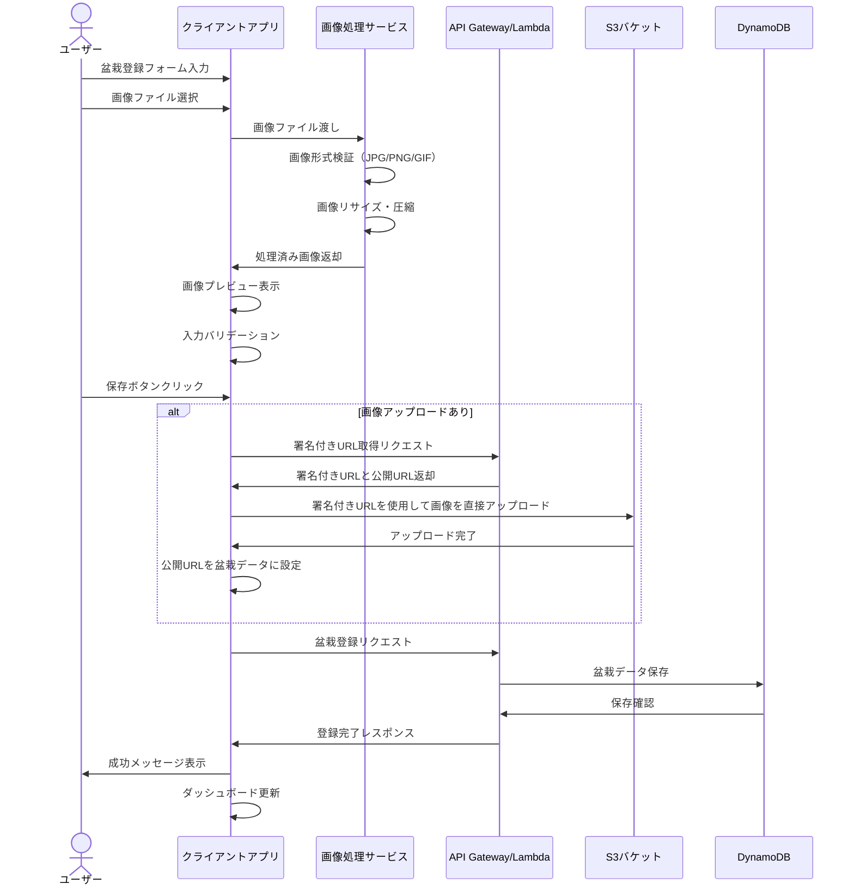
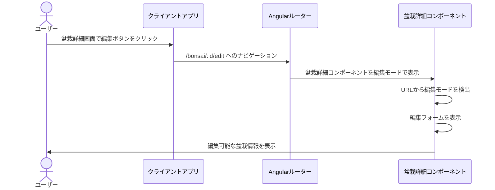
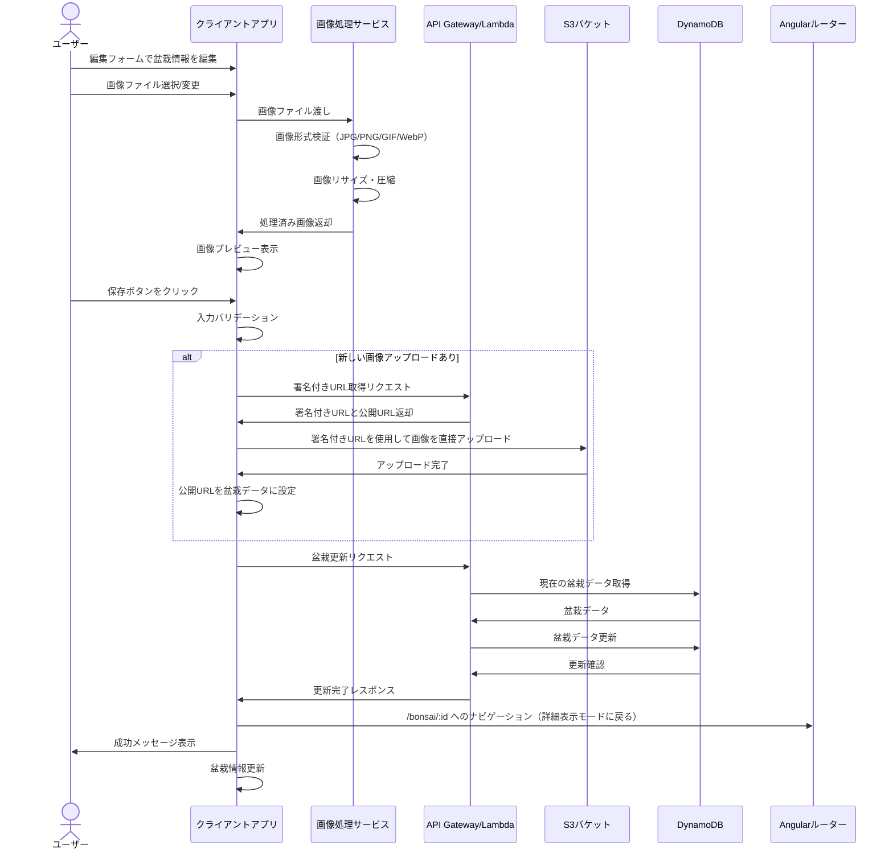
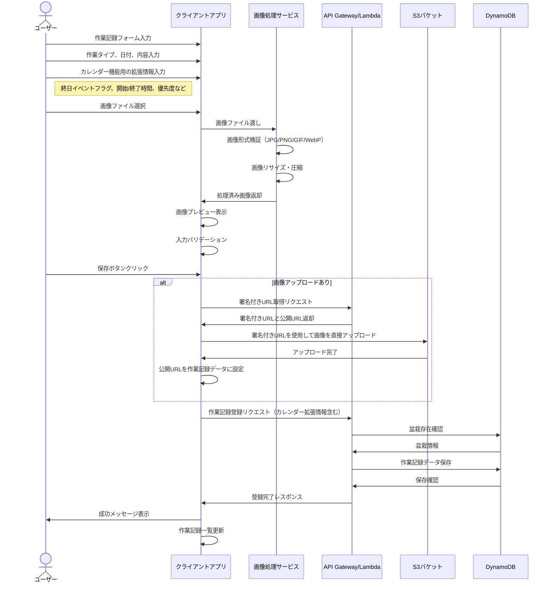
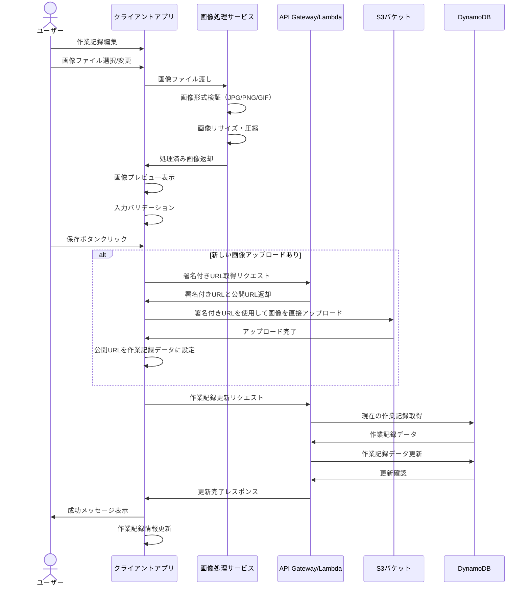
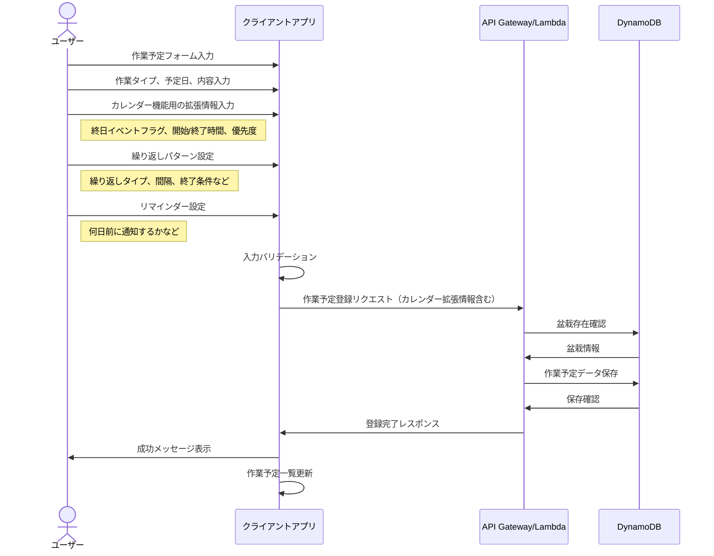
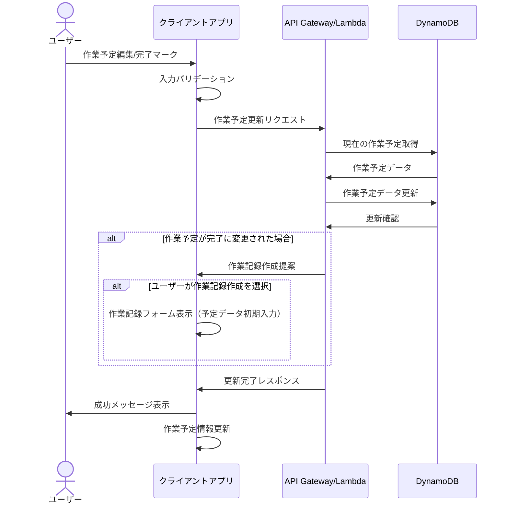

# 処理フロー

このドキュメントでは、Bonsai App（盆栽管理アプリ）の主要な処理フローを定義します。

## 目次

1. [認証フロー](#認証フロー)
2. [盆栽管理フロー](#盆栽管理フロー)
3. [作業記録管理フロー](#作業記録管理フロー)
4. [作業予定管理フロー](#作業予定管理フロー)

## 認証フロー

### サインアップフロー

### サインインフロー

### トークンリフレッシュフロー

## 盆栽管理フロー

### 盆栽登録フロー

### 盆栽編集モード遷移フロー

### 盆栽情報更新フロー

## 作業記録管理フロー

### 作業記録登録フロー

### 作業記録更新フロー

## 作業予定管理フロー

### 作業予定登録フロー

### 作業予定更新フロー

