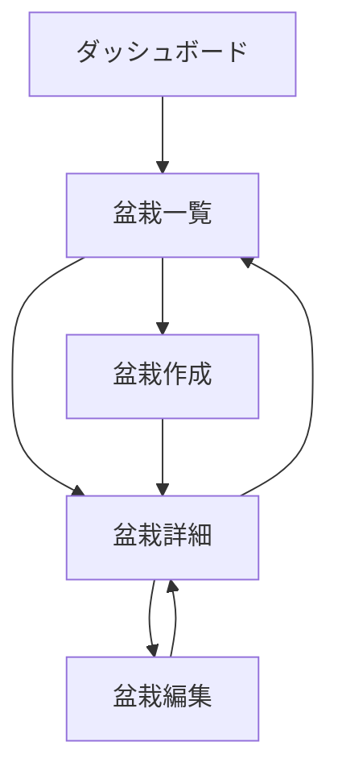
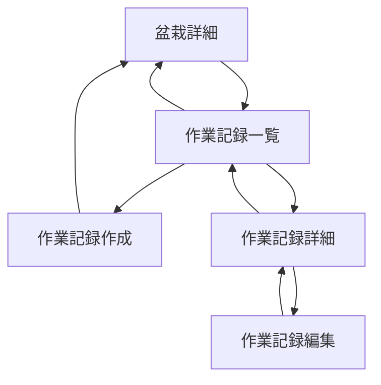
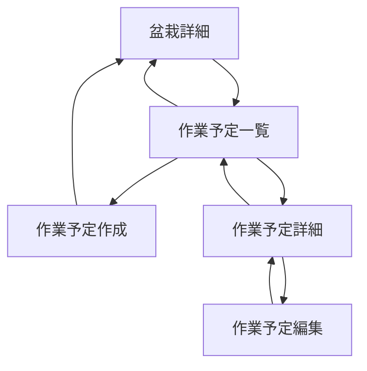
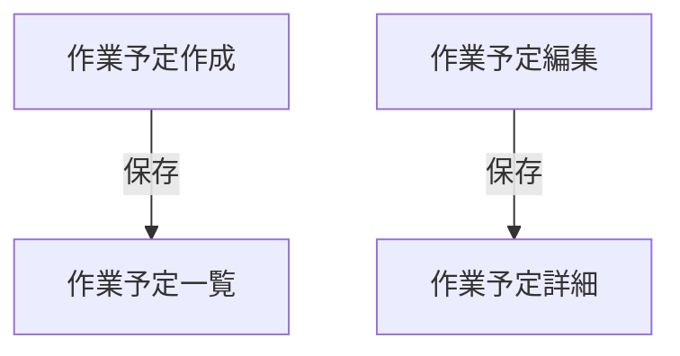
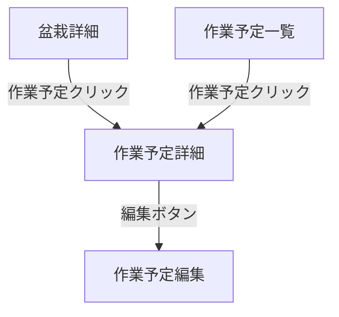
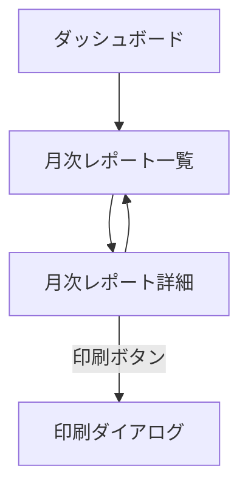

# ルーティング設計

このドキュメントでは、Bonsai App（盆栽管理アプリ）のクライアントサイドのルーティング構造を定義します。

## 目次

1. [基本ルーティング](#基本ルーティング)
2. [認証関連ルート](#認証関連ルート)
3. [盆栽関連ルート](#盆栽関連ルート)
4. [作業記録関連ルート](#作業記録関連ルート)
5. [作業予定関連ルート](#作業予定関連ルート)
6. [月次レポート関連ルート](#月次レポート関連ルート)
7. [ナビゲーションフロー](#ナビゲーションフロー)

## 基本ルーティング

| パス | コンポーネント | 認証 | 説明 |
|------|--------------|------|------|
| `/` | リダイレクト | - | ダッシュボードにリダイレクト |
| `/dashboard` | DashboardComponent | 必須 | ダッシュボード画面 |
| `**` | リダイレクト | - | 存在しないルートはダッシュボードにリダイレクト |

## 認証関連ルート

| パス | コンポーネント | 認証 | 説明 |
|------|--------------|------|------|
| `/auth/login` | LoginComponent | 不要 | ログイン画面 |

## 盆栽関連ルート

| パス | コンポーネント | 認証 | 説明 |
|------|--------------|------|------|
| `/bonsai` | BonsaiListComponent | 必須 | 盆栽一覧画面 |
| `/bonsai/:id` | BonsaiDetailComponent | 必須 | 盆栽詳細画面 |
| `/bonsai/:id/edit` | BonsaiDetailComponent | 必須 | 盆栽編集画面（編集モード） |

## 作業記録関連ルート

| パス | コンポーネント | 認証 | 説明 |
|------|--------------|------|------|
| `/bonsai/:id/records` | WorkRecordListComponent | 必須 | 作業記録一覧画面 |
| `/bonsai/:id/records/new` | WorkRecordFormComponent | 必須 | 作業記録作成画面 |
| `/records/:id` | WorkRecordDetailComponent | 必須 | 作業記録詳細画面 |
| `/records/:recordId/edit` | WorkRecordFormComponent | 必須 | 作業記録編集画面 |

## 作業予定関連ルート

| パス | コンポーネント | 認証 | 説明 |
|------|--------------|------|------|
| `/bonsai/:id/schedules` | WorkScheduleListComponent | 必須 | 作業予定一覧画面 |
| `/bonsai/:id/schedules/new` | WorkScheduleFormComponent | 必須 | 作業予定作成画面 |
| `/schedules/:id` | WorkScheduleDetailComponent | 必須 | 作業予定詳細画面 |
| `/schedules/:scheduleId/edit` | WorkScheduleFormComponent | 必須 | 作業予定編集画面 |

## 月次レポート関連ルート

| パス | コンポーネント | 認証 | 説明 |
|------|--------------|------|------|
| `/reports` | MonthlyReportListComponent | 必須 | 月次レポート一覧画面 |
| `/reports/:year/:month` | MonthlyReportDetailComponent | 必須 | 月次レポート詳細画面 |

## ナビゲーションフロー

### 盆栽管理フロー

### 作業記録管理フロー

### 作業予定管理フロー

### 作業予定保存後のナビゲーションフロー

作業予定の保存後は、作業予定一覧ページに遷移します。これにより、ユーザーは作業予定を保存した後、その盆栽の作業予定一覧を確認できます。

### 作業予定の表示と編集

作業予定の詳細を表示する専用のコンポーネント（WorkScheduleDetailComponent）があります。盆栽詳細画面や作業予定一覧画面から作業予定をクリックすると、作業予定詳細画面に遷移します。詳細画面から編集ボタンをクリックすると、作業予定編集画面に遷移します。

### 月次レポート管理フロー

